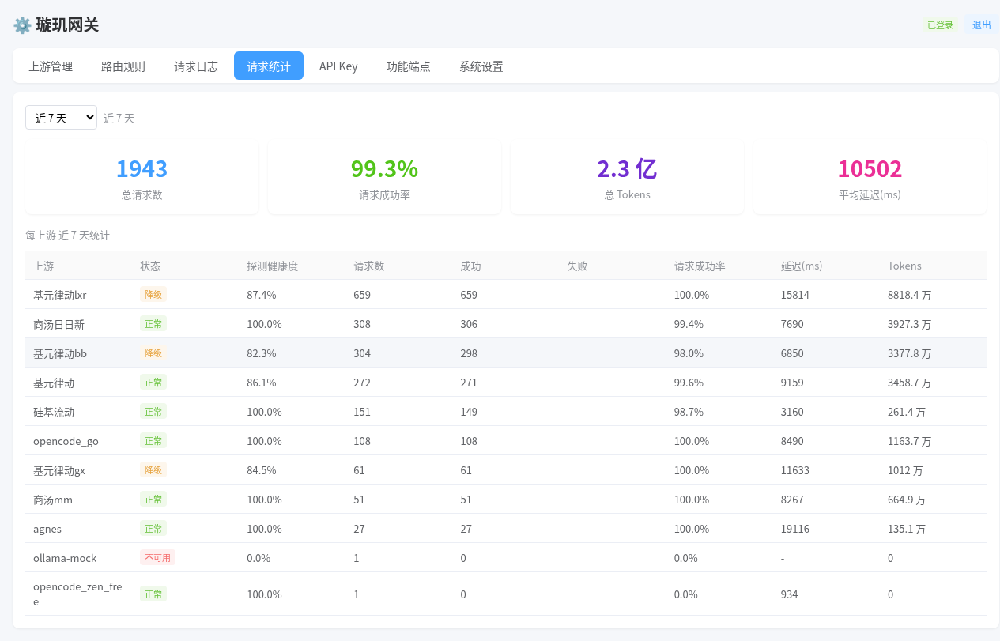
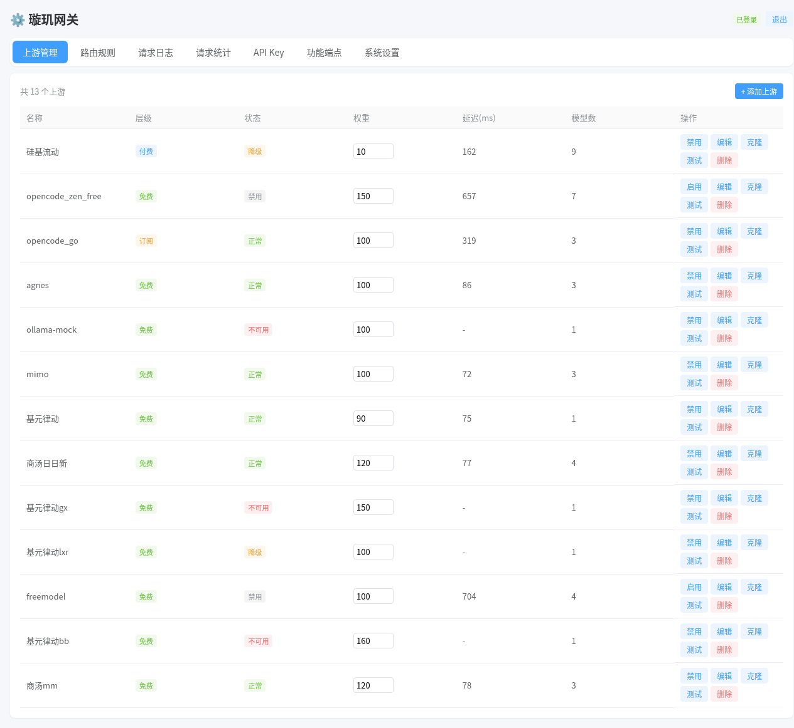
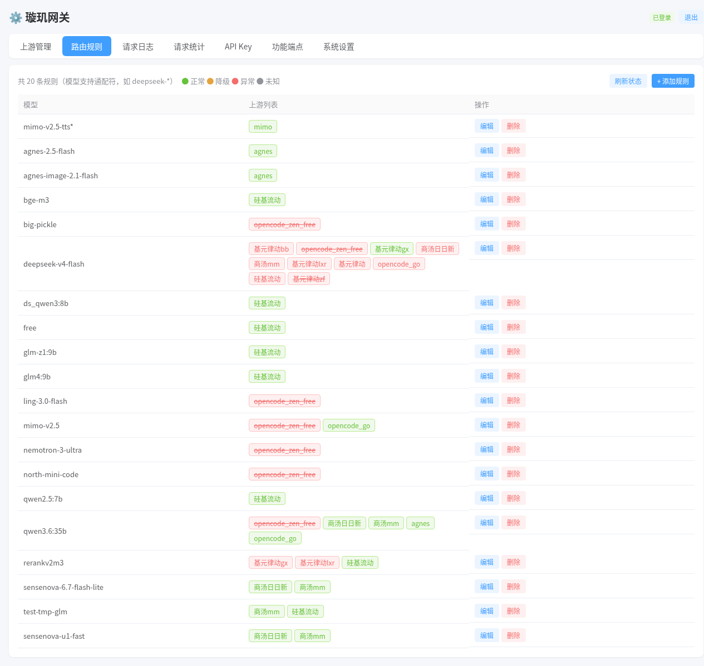
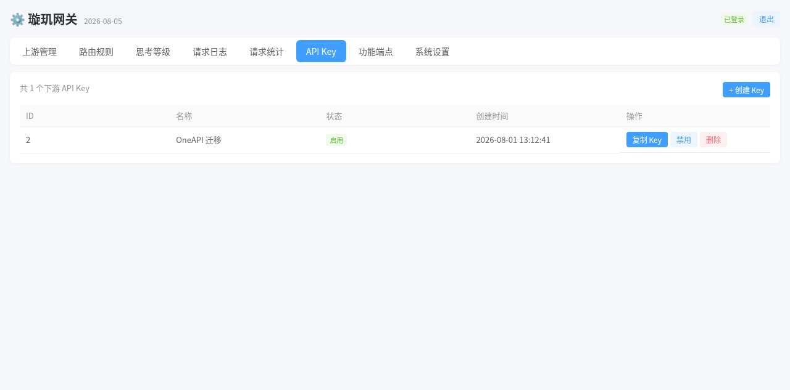

# 我花两周手搓了个 AI 网关，把 Claude Code 的 API 成本砍了 60%——因为上游半夜抽风这事我受够了

> Go · OpenAI/Anthropic 双协议 · 成本优先路由 · 自动故障切换
> 开源地址在文末。

## 先说账单

做 AI 应用的人，每个月打开云厂商账单那一刻都血压飙升：

- 手上有 **硅基流动、商汤、DeepSeek 中转、各种免费渠道** 五六个 API Key，哪个有免费额度、哪个快、哪个稳，全靠脑子记；
- Claude Code / OpenCode / 各类 Agent 框架，每家只认一种协议，渠道多了根本没法统一；
- 某家上游**半夜抽风**，请求批量失败，第二天起来看日志才发现昨晚的 Agent 全断了；
- 付费渠道和免费渠道混在一起，没有调度逻辑——**白嫖额度永远用不完，付费账单倒是先爆了**。

我的情况更糟：每天跑几十个 Agent 任务，tokens 一天几百万，稍微调度不合理，一天就是大几十块。

## 市面网关的坑

不是没试过现成的——OneAPI、New-API 都是成熟方案。但用下来别扭：

1. **重**：Go 单二进制但功能堆得重，Docker 镜像 ~200MB，还得配套 MySQL/Redis 才能玩转；
2. **协议兼容差**：流式 SSE 丢行、工具调用字段丢失、多模态 content 结构被拆坏；
3. **没有成本路由**：它们只管转发，不管"这个模型该走免费还是付费"。

## 我的解法：璇玑 Xuanji

一句话：**Go 单二进制的 AI 协议网关**，给 Hermes、Claude Code、OpenCode 等工具一个统一入口，汇聚多家上游，**按成本与健康状态自动分流**。

## 成本是怎么降的：三级计费路由

这是我最得意的一块。每个模型可以绑定多个上游，网关按 **计费层级** 调度：

```
免费层（free）→ 订阅层（subscription）→ 付费层（payg）
```

规则极简：**有免费先走免费，免费挂了升订阅，订阅再挂才动付费**。

配合权重调度：同层级内按权重分配流量，高权重多发、低权重少发，避免单点过载。

实测效果——近 7 天 1943 个请求，2.3 亿 tokens，请求成功率 99.3%：



其中相当一部分流量吃的是免费额度，付费账单肉眼可见地降了。**"成本砍 60%"不是标题党，是把流量引导到免费/订阅层的自然结果。**

## 双协议原生，不是"翻译"是"透传"

大多数网关只做 OpenAI 协议，Anthropic 协议要靠一层"翻译"——翻译就必然有损。

璇玑是**双协议原生实现**：

| 协议 | 端点 | 说明 |
|------|------|------|
| **OpenAI** | `POST /v1/chat/completions` | 聊天补全（流式/非流式） |
| | `POST /v1/embeddings` | 文本嵌入 |
| | `POST /v1/images/generations` | 图片生成 |
| | `POST /v1/rerank` | 重排 |
| | `POST /v1/audio/speech` | 语音合成 |
| | `POST /v1/audio/transcriptions` | 语音识别 |
| | `GET /v1/models` | 模型列表 |
| **Anthropic** | `POST /v1/messages` | Claude 消息（流式事件转换） |

- **流式 SSE 逐行透传**，不缓冲、不截断，首 token 延迟做到最低；
- **工具调用、多模态字段**完整保留，content 结构不被破坏；
- Claude Code 直接连：`ANTHROPIC_BASE_URL` 指向网关，`ANTHROPIC_AUTH_TOKEN` 用网关发的 Key，模型全部映射到渠道池。

## 高可用：上游挂了不中断

- **自动分流**：每个模型绑定多个上游，按计费层级、权重、健康度自动选通道；
- **自动重试**：上游失败自动切同层下一个，整层失败自动升层级——**不会因为任何一个上游故障导致请求中断**；
- **健康检查**：每上游独立探测，healthy / degraded / dead 三态；
- **快速失败熔断**：失败上游自动进冷却名单，后台定时探测自动恢复；
- **客户端断连保护**：客户端断连不误拉黑上游（这坑我踩过：6 个上游被误拉黑，已修复并加了回归测试）。





## 零配置：全数据库化，即改即热重载

所有配置——上游、路由规则、折扣、API Key——全部存在 SQLite 里，页面 CRUD **即改即热重载**，不用重启、不用改 YAML。



管理 API 还带独立鉴权 key，AI 助手可以免登录动态改配置——让 Agent 自己调路由、自己加渠道，网关变成可编程基础设施。

## 多 Key 统计：知道钱花在哪了

给每个 AI 程序分配不同 API Key，管理页统计 Tab 就能按 Key 看用量：哪个程序请求多、token 用得多、成功率如何。**每一分钱花在哪个程序上，清清楚楚。**

## 极致的轻

- **单二进制**：Go 静态编译，13MB，解压即用；
- **SQLite 存储**：纯 Go 实现，无 CGO；
- **部署**：`docker compose up -d` 一行拉起，镜像 18MB。

```bash
docker compose up -d --build
# 或直接跑二进制
./xuanji-server --port 8787 --db /path/to/xuanji.db
```

## 质量

**144 个自动化测试全绿**，覆盖双协议转换、路由调度、熔断恢复、上下文取消等关键路径。生产环境持续运行验证。

## 开源地址

- GitHub：https://github.com/icefairy/xuanji
- Gitee 镜像（国内快）：https://gitee.com/icefairy/xuanji-gateway

Star 支持一下，有问题欢迎提 Issue。

---

*个人业余作品，不用微服务、不用 K8s，单机单二进制解决 90% 的问题。适合：个人开发者、小团队、自建 AI 基础设施的人。没有计费功能，短期内也不打算加——个人用，够了。*
