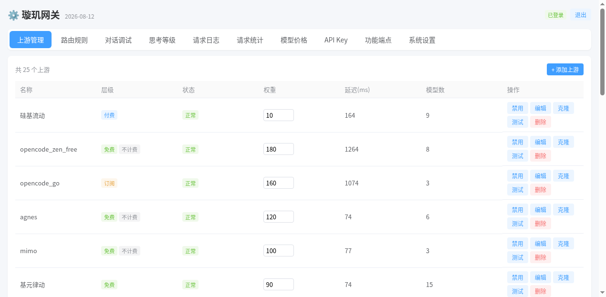
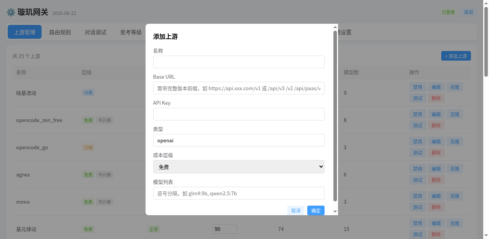
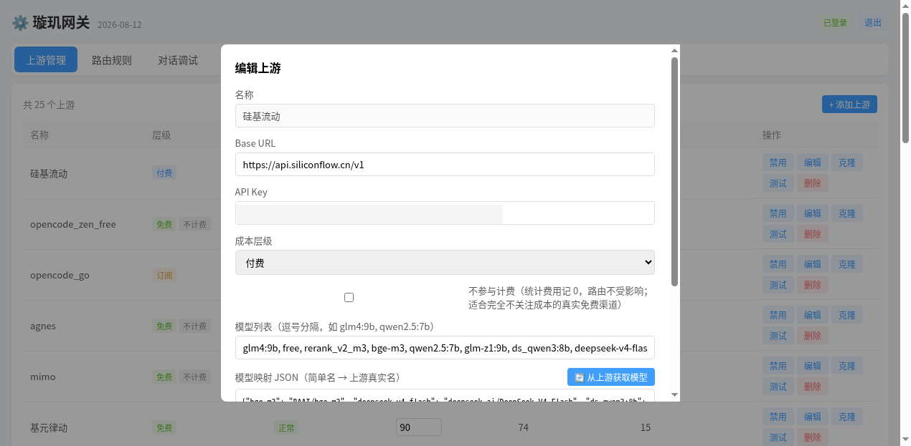
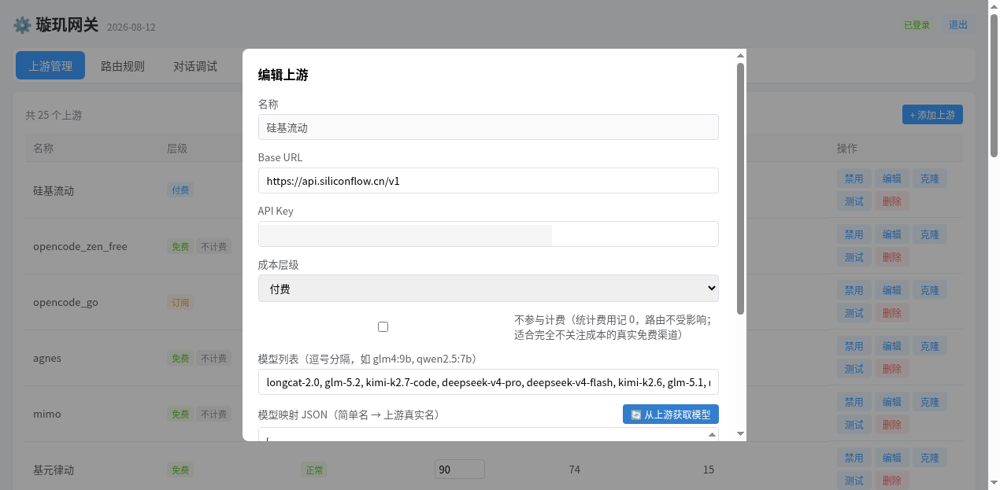
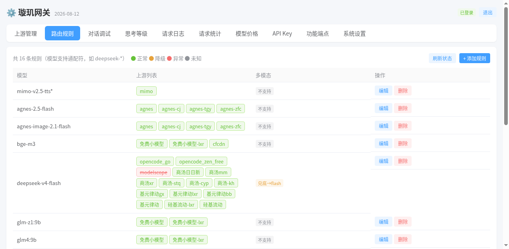
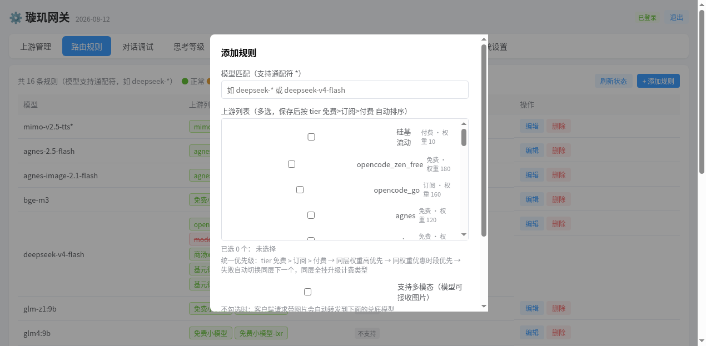
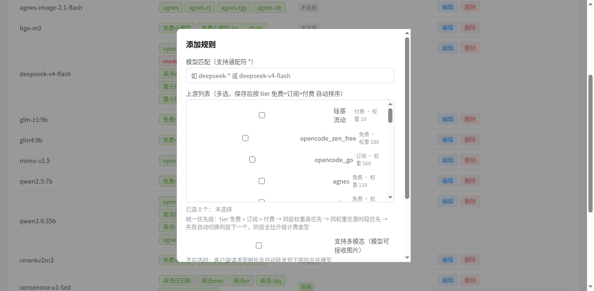
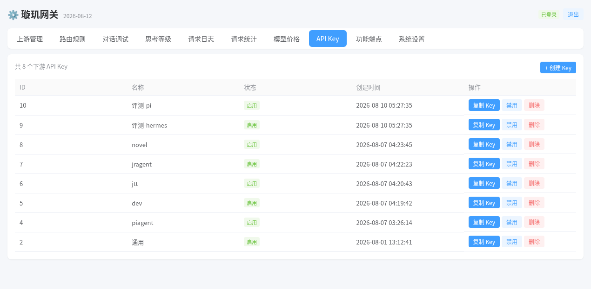
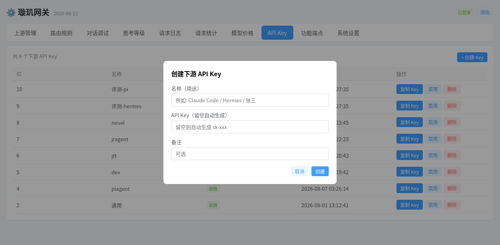
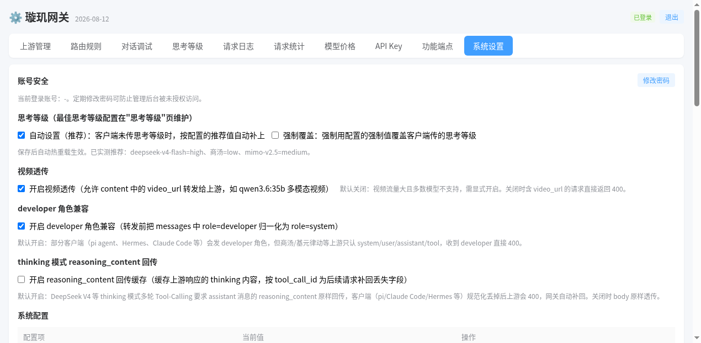

# 璇玑网关 使用说明（小白版）

璇玑网关是一个 AI 接口中转站。你把各个 AI 厂商的 API（比如 DeepSeek、商汤、硅基流动）接进来，它帮你统一管理、自动切换、按最省钱的方式路由，然后给你一个统一的接口地址。

别人（或你自己的程序）只需要记住这一个地址，不用管后面接了几家 AI。

下面跟着做，10 分钟就能配好。

---

## 第一步：添加上游（把 AI 厂商接进来）

打开管理页面，点导航栏的「上游管理」，看到所有已接入的 AI 厂商列表（这叫"上游"）。



点右上角的 **「+ 添加上游」**：



只需要填 4 项：

1. **名称**：自己起的名字，比如 `我的DeepSeek`，方便认就行
2. **Base URL**：AI 厂商给你的接口地址，一般是 `https://xxx.com/v1` 这种，厂商文档里有
3. **API Key**：AI 厂商给你的密钥（一串字符）
4. **成本层级**：这个厂商怎么收费——免费 / 订阅 / 付费。选对很重要，网关靠这个帮你省钱的

**其他字段先不用管**（尤其是模型列表，很多厂商有几十上百个模型，不用手动填）。

点「确定」保存。

### 让网关自动获取模型列表

在上游列表里找到刚加的厂商，点它的 **「编辑」**：



点 **「从上游获取模型」** 按钮，网关会自动向这个厂商要一份完整的模型清单，并自动生成"简单名 → 真实名"的映射：



看到模型列表和映射自动填好了，点「确定」保存。

> 为什么要自动获取？因为有些厂商有几十上百个模型，手动填容易错，自动拉取最准。

---

## 第二步：配置路由规则（决定请求走哪家）

点导航栏的「路由规则」，点 **「+ 添加规则」**：



弹窗里配 3 样东西：



1. **模型匹配**：起一个你自己用的名字，比如 `auto`
   - 这个名字必须能在上游的模型列表里找到（比如你可以把 `auto` 映射成上游的 `deepseek-v4-flash`）
   - 也支持通配符，比如 `deepseek-*` 就能匹配所有 deepseek 开头的模型

2. **上游列表**：勾选哪些 AI 厂商可以用（可以多选）
   - 勾多个就是"自动切换"：第一个挂了自动切下一个，哪个便宜优先走哪个

3. **多模态（图片）**：
   - 如果这个模型支持看图（多模态），勾上「支持多模态」
   - 如果不支持，但你想让"带图请求"也能用，在「多模态兑底模型」填一个支持图片的模型名——这样带图的请求会自动转发给那个模型处理



点「确定」保存，路由规则就配好了。

---

## 第三步：创建 API Key（发给使用的人）

点导航栏的「API Key」，点 **「+ 创建 Key」**：





填一个**名称**（用途，比如"我的程序"、"同事小张"），Key 留空会自动生成。

创建后拿到一个 `sk-` 开头的密钥，这就是访问网关的钥匙。

### 怎么用这个 Key 调接口

把你的 AI 工具或程序指向：

```
http://你的服务器IP:3002/v1
```

请求头带上：

```
Authorization: Bearer sk-你的密钥
```

模型名填你第二步起的名字（比如 `auto`），其他用法和官方 OpenAI 接口一模一样。

---

## 第四步：系统设置（改密码 + 备份）

点导航栏的「系统设置」：



1. **修改密码**：默认密码记得改掉，防止别人进你的管理后台
2. **立即备份**：配置都弄好后，点一下「立即备份」，把数据库手动备份一次（系统每周也会自动备份，保留最近 10 份）

---

## 常见问题

**Q：请求地址是 IP:端口，不能用绑定的域名吗？**

可以。网关本身不绑定域名，任何能访问到你服务器的域名都能用（域名解析到这台机器，或用 Nginx/Caddy 反代 3002 端口即可）。把 `http://你的服务器IP:3002/v1` 换成 `https://你的域名/v1` 就行。

**Q：后台复制的 Key，还需要加前缀吗？**

不用。`Bearer` 是 HTTP 认证协议的关键字，不是 Key 的一部分。

- 代码里用官方 SDK（如 OpenAI 库）：直接把 Key 传给 `api_key` 参数，SDK 自动处理
- 只有手写 curl / HTTP 请求时，才需要写成：`Authorization: Bearer sk-你的key`

---

## 配置顺序总结（记这 3 步就行）

```
1) 上游管理：添加上游（名称/BaseURL/APIKey/层级）→ 编辑 → 从上游获取模型
2) 路由规则：添加规则（起名 → 勾上游 → 选多模态/兜底）
3) API Key：创建 Key → 把 Key 发给使用者 → 指向 ip:port/v1
```

配好这三步，别人就能用你给的 Key 调 AI 了。其他功能（对话调试、请求日志、统计）都是辅助，后面慢慢玩。
